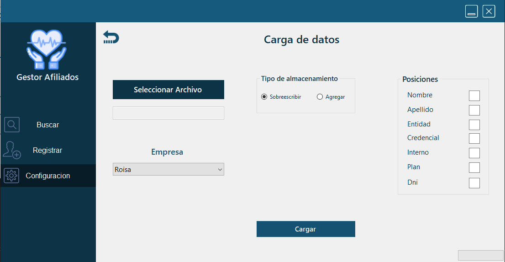

<!-- ENCABEZADO TITULO -->
# Proyecto: Gestor de Afiliados.

## Desarrollador:
* Agustin Matias Garcia Navas

## Descripcion:

La aplicacion fue creada para una importante prepaga de salud, con el objetivo de poder agregar,eliminar y buscar los afiliados de distintas maneras. Estos se extraen desde un EXCEL y se almacenan en un JSON.

## Contenidos utilizados

* C#
* .NET (WinForms)
* POO
* Programacion multithreading
* Principios SOLID 
* Archivos XLSM,CSV,JSON

## Imagenes de la aplicacion:

